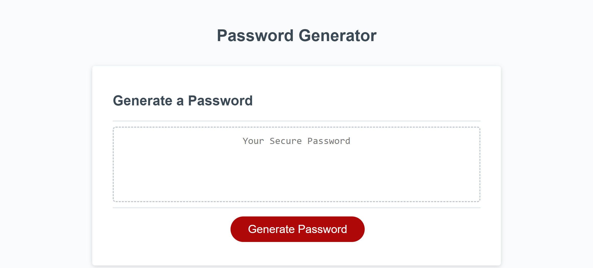

# Password Generator 

## Description

This project is a password generator that uses JavaScript code to create a new, secure password based on the user's chosen criteria. The generator provides a series of prompts for password criteria, including password length and character types to include, and generates a password that matches the selected criteria.

https://mattlombard.github.io/Create-A-Password/

## Usage

When the user clicks the button to generate a password, they are presented with a series of prompts for password criteria. These prompts ask the user to select the length of the password (between 8 and 128 characters) and which types of characters to include (lowercase, uppercase, numeric, and/or special characters).

Once the user has answered all prompts and their input has been validated, a password is generated that matches the selected criteria. The password can be either displayed in an alert or written to the page.

## Credits

Dennis Itua (tutor)

Collaborated with: Chris Snyder and Sarah Miller
